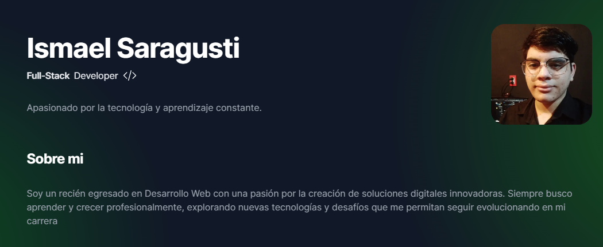

<div align="center">
  
</div>

# saragusti.dev

Bienvenidos a mi sitio web personal. Aquí encontrarás información sobre mí, mis proyectos y mis pensamientos sobre el desarrollo web y tecnología en general.

[Reportar un problema](https://github.com/Ismox1440/saragusti.dev/issues/new) · [Sitio Web](https://saragusti.dev/)

## 🚀 Cómo empezar

1. **Clona el repositorio:**

```sh
git clone https://github.com/Ismox1440/saragusti.dev.git
```
2. **Clona el repositorio:**

```sh
npm install
```

3. **Inicia el servidor de desarrollo:**

```sh
npm run dev
```


## 💻 Tecnologías

- [Next.js](https://nextjs.org/)
- [Tailwind CSS](https://tailwindcss.com/)
- [Vercel](https://vercel.com/)

🤝 Contribuciones

¡Las contribuciones son siempre bienvenidas! Si encuentras algún problema o tienes una sugerencia de mejora, por favor abre un issue. También puedes hacer un fork del repositorio, hacer tus cambios y crear un pull request.


